# Creating GKE cluster with ingress, network policy, and autoscaling

# List of works.
-----
 
## 1. Kubernetes Cluster Setup
## 2. Build and Push Web Application 
## 3. Deploy Web Application into the kubernetes cluster
## 4. Adding Network policy for the security purposes 
## 5. Autoscaling Based on HTTP Request Rate
## 6. Incident Simulation
</br >
</br > 

# Common task: Installing necessary tools.

- [x] DOCKER installing:
```shell
curl -fsSL https://get.docker.com | sudo bash
```
- [x] GCLOUD installing:
```shell
echo "deb [signed-by=/usr/share/keyrings/cloud.google.gpg] https://packages.cloud.google.com/apt cloud-sdk main" | tee -a /etc/apt/sources.list.d/google-cloud-sdk.list && curl https://packages.cloud.google.com/apt/doc/apt-key.gpg | sudo gpg --dearmor -o /usr/share/keyrings/cloud.google.gpg && sudo apt update -y && apt-get install google-cloud-sdk -y && \ 
sudo apt-get install -y google-cloud-cli-gke-gcloud-auth-plugin
```
- [x] TERRAFORM installing:
```shell
sudo apt-get install -y gnupg software-properties-common &&
wget -O- https://apt.releases.hashicorp.com/gpg | gpg --dearmor | sudo tee /usr/share/keyrings/hashicorp-archive-keyring.gpg > /dev/null
gpg --no-default-keyring --keyring /usr/share/keyrings/hashicorp-archive-keyring.gpg --fingerprint &&
echo "deb [signed-by=/usr/share/keyrings/hashicorp-archive-keyring.gpg] \
https://apt.releases.hashicorp.com $(lsb_release -cs) main" | sudo tee /etc/apt/sources.list.d/hashicorp.list && sudo apt update -y && \
sudo apt-get install -y terraform
```
- [x] KUBECTL installing:
```shell
sudo apt-get install -y apt-transport-https ca-certificates curl gnupg && \
sudo mkdir -p -m 755 /etc/apt/keyrings && \
curl -fsSL https://pkgs.k8s.io/core:/stable:/v1.32/deb/Release.key | sudo gpg --dearmor -o /etc/apt/keyrings/kubernetes-apt-keyring.gpg && \
sudo chmod 644 /etc/apt/keyrings/kubernetes-apt-keyring.gpg && \
echo 'deb [signed-by=/etc/apt/keyrings/kubernetes-apt-keyring.gpg] https://pkgs.k8s.io/core:/stable:/v1.32/deb/ /' | sudo tee /etc/apt/sources.list.d/kubernetes.list && sudo chmod 644 /etc/apt/sources.list.d/kubernetes.list && \
sudo apt-get update -y && \
sudo apt-get install -y kubectl
```
- [x] HELM installing:
```shell
curl https://baltocdn.com/helm/signing.asc | gpg --dearmor | sudo tee /usr/share/keyrings/helm.gpg > /dev/null && \
sudo apt-get install apt-transport-https --yes && \
echo "deb [arch=$(dpkg --print-architecture) signed-by=/usr/share/keyrings/helm.gpg] https://baltocdn.com/helm/stable/debian/ all main" | sudo tee /etc/apt/sources.list.d/helm-stable-debian.list && \
sudo apt-get update -y && sudo apt-get install helm
```
- [X] k6 installation
```shell
sudo gpg -k
sudo gpg --no-default-keyring --keyring /usr/share/keyrings/k6-archive-keyring.gpg --keyserver hkp://keyserver.ubuntu.com:80 --recv-keys C5AD17C747E3415A3642D57D77C6C491D6AC1D69
echo "deb [signed-by=/usr/share/keyrings/k6-archive-keyring.gpg] https://dl.k6.io/deb stable main" | sudo tee /etc/apt/sources.list.d/k6.list
sudo apt-get update -y && sudo apt-get install k6
```

# 1. Kubernetes Cluster Setup
- Login into GCP console using your login and password.
- Create new project. (we will use it while creating infrastructure).
- Create artifact registry for docker images.
- Deploy kubernetes cluster with terraform tool:
```shell
cd terraform
terraform init
terraform plan
gcloud auth application-default login #necessary for terraform
terraform apply
```
- Checking newly created cluster in GCP console.
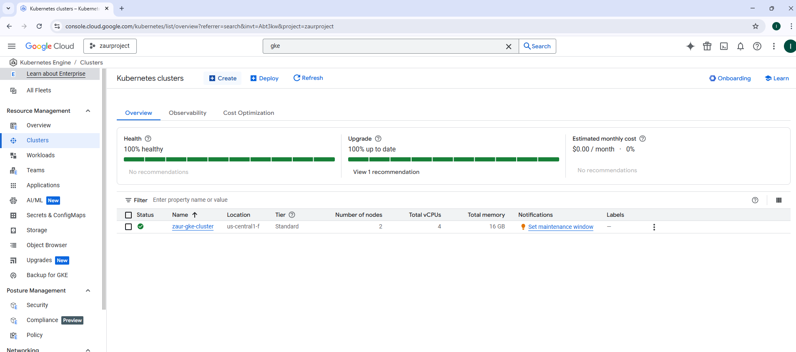

- Login to created cluster with gcloud tool.
```shell

gcloud config set compute/region us-central1
gcloud config set compute/zone us-central1-f
gcloud container clusters get-credentials zaur-gke-cluster

```
- Checking cluster with kubectl tool.
```shell

kubectl config get-clusters

```
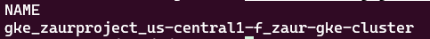
- You can check list of all available pods by command:
```shell

kubectl get po -A

```

# 2. Build and Deploy Web Application
We will use sample web application with three endpoints ( '/', '/health', and '/chaos' )
```python

@app.route('/', methods=['GET'])
def index():
    """Standard application response."""
    return jsonify({"message": "Hello from world!"})

@app.route('/chaos', methods=['GET'])
def chaos():
    """Endpoint to trigger a health-check failure scenario."""
    global IsChaosEnabled
    IsChaosEnabled = not IsChaosEnabled  # Toggle the chaos state

    if IsChaosEnabled:
        return jsonify({"message": "Chaos mode activated!"}), 500  # Simulate failure
    else:
        return jsonify({"message": "Chaos mode deactivated!"})

@app.route('/health', methods=['GET'])
def health():
    """Health check endpoint. Return 200 if healthy, 500 if chaotic."""
    if IsChaosEnabled:
        return jsonify({"status": "unhealthy"}), 500
    else:
        return jsonify({"status": "healthy"}), 200

```
Get whole code in the webapp folder.

- [X] Creating docker image from python code:
```shell
cd webapp
sudo docker build -t python-http-app .
sudo docker images # will show us docker images
```
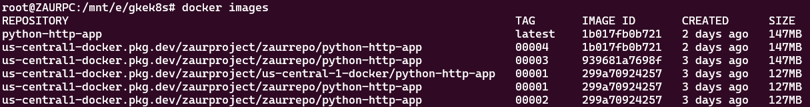

- [X] Tagging and Pulling created docker image into google cloud registry:
```shell
docker tag 1b017fb0b721 us-central1-docker.pkg.dev/zaurproject/zaurrepo/python-http-app:00004
docker push us-central1-docker.pkg.dev/zaurproject/zaurrepo/python-http-app:00004
```
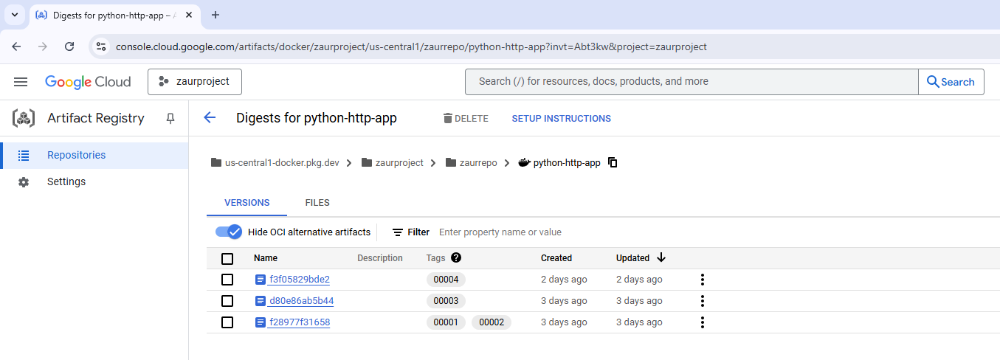


## 3. Deploying Web Application into the kubernetes cluster

- [X] Connecting to the cluster
```shell

gcloud config set compute/region us-central1
gcloud config set compute/zone us-central1-f
gcloud container clusters get-credentials zaur-gke-cluster

```
- [X] Creating new namespace for our application
```shell
kubectl create namespace webapp
```

- [X] Deploying webapp application to the kubernetes
```shell
cd k8s
kubectl apply -f webapp-deployment.yaml
```
- [X] Checking newly created deployment
```shell
kubectl describe deployment webapp -nwebapp
```
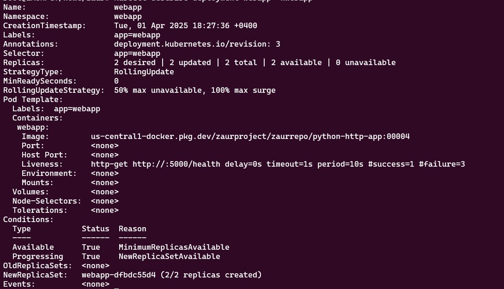
- [X] Checking for running pods
```shell
kubectl get po -nwebapp
```
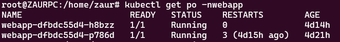

- [X] Adding ingress controller and application service
```shell
kubectl apply -f webapp-service.yaml
kubectl apply -f ingress-controller.yaml
kubectl apply -f ingress.yaml
```
```shell
kubectl get svc -nwebapp
```
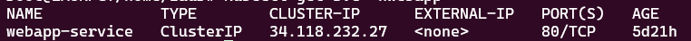
```shell
kubectl get ingress -nwebapp
```


- [X] Adding host name webapp.loc to our host file and check
```shell
curl http://webapp.loc
```
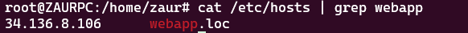
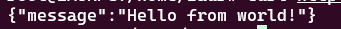

# 4. Adding Network policy for the security purposes 
- [X] Deny all traffic between pods in webapp namesapace
```shell
cd k8s
kubectl apply -f NetworkDenyAll.yaml
```

- [X] Allow only ingress traffic from ingress controller
```shell
cd k8s
kubectl apply -f NetworkAllowFromIngress.yaml
```

- [X] Testing networks
```shell
kubectl get po -nwebapp -o wide
```
```shell
NAME                     READY   STATUS    RESTARTS        AGE     IP           NODE                                                  NOMINATED NODE   READINESS GATES
webapp-dfbdc55d4-h8bzz   1/1     Running   0               4d17h   10.92.1.21   gke-zaur-gke-cluster-primary-node-poo-d1b4ea3c-f7pu   <none>           <none>
webapp-dfbdc55d4-p786d   1/1     Running   3 (4d18h ago)   5d      10.92.2.13   gke-zaur-gke-cluster-primary-node-poo-d1b4ea3c-xywy   <none>           <none>
```
Connecting to the first pod and ping the second pod:
```shell
kubectl exec -it -nwebapp webapp-dfbdc55d4-h8bzz -- /bin/bash
```
```shell
root@webapp-dfbdc55d4-h8bzz:/app# ping 10.92.2.13
PING 10.92.2.13 (10.92.2.13) 56(84) bytes of data.

--- 10.92.2.13 ping statistics ---
18 packets transmitted, 0 received, 100% packet loss, time 454ms

root@webapp-dfbdc55d4-h8bzz:/app#
```
Connecting to the second pod and ping the first pod:
```shell
kubectl exec -it -nwebapp webapp-dfbdc55d4-p786d -- /bin/bash
```
```shell
root@webapp-dfbdc55d4-p786d:/app# ping 10.92.1.21
PING 10.92.1.21 (10.92.1.21) 56(84) bytes of data.

--- 10.92.1.21 ping statistics ---
17 packets transmitted, 0 received, 100% packet loss, time 410ms

root@webapp-dfbdc55d4-p786d:/app#
```

# 5. Autoscaling Based on HTTP Request Rate
- [X] Deploying prometheus
```shell
helm repo add prometheus-community https://prometheus-community.github.io/helm-charts
helm repo update
helm install webapp-prom prometheus-community/prometheus --create-namespace -n monitoring
```
```shell
kubectl get po -nmonitoring
```
```shell
NAME                                                  READY   STATUS    RESTARTS   AGE
webapp-prom-alertmanager-0                            1/1     Running   0          5d2h
webapp-prom-kube-state-metrics-5f466455c5-wqhkb       1/1     Running   0          5d2h
webapp-prom-prometheus-node-exporter-8tvwh            1/1     Running   0          5d2h
webapp-prom-prometheus-node-exporter-8zcnh            1/1     Running   0          5d2h
webapp-prom-prometheus-pushgateway-5f5ff48f7c-9jv7c   1/1     Running   0          5d2h
webapp-prom-prometheus-server-84f456874b-wtsqj        2/2     Running   0          5d2h
```
- [X] Deploying KEDA
```shell
helm repo add kedacore https://kedacore.github.io/charts
helm repo update
helm install keda kedacore/keda --namespace keda --create-namespace
```
```shell
kubectl get po -nkeda
```
```shell
NAME                                               READY   STATUS    RESTARTS        AGE
keda-admission-webhooks-7589cd46c7-2ttsp           1/1     Running   0               4d18h
keda-operator-b479b44bd-68r5d                      1/1     Running   1 (4d18h ago)   4d18h
keda-operator-metrics-apiserver-5bfbf87b69-rcd6d   1/1     Running   0               4d18h
```
- [X] Deploying KEDA scaledobject
```shell
kubectl apply -f hpa.yaml
```
```shell
kubectl get scaledobject -nwebapp
```
```shell
NAME               SCALETARGETKIND      SCALETARGETNAME   MIN   MAX   READY   ACTIVE   FALLBACK   PAUSED    TRIGGERS   AUTHENTICATIONS   AGE
ingress-requests   apps/v1.Deployment   webapp            2     15    True    False    False      Unknown                                4d18h
```
- [X] Testing Prometheus
```shell
export POD_NAME=$(kubectl get pods --namespace monitoring -l "app.kubernetes.io/name=prometheus,app.kubernetes.io/component=server" -o jsonpath="{.items[0].metadata
.name}")
```
```shell
kubectl --namespace monitoring port-forward $POD_NAME 9090
```
Open web browser with http://127.0.0.1:9090
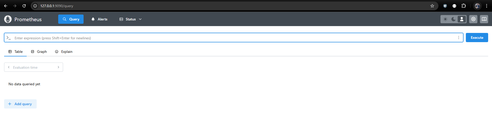
Run query "nginx_ingress_controller_requests" to see nginx-ingress request.
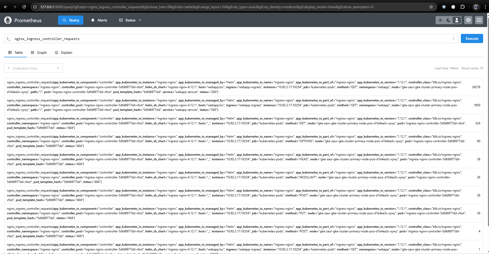
- [X] Testing auto scaling
We will use k6 Grafana tools for testing.
```shell
cd tests
#that test will prepare 100 clients and connects to webapp during 120sec
k6 run --vus 100 --duration 120s k6_test.js

         /\      Grafana   /‾‾/
    /\  /  \     |\  __   /  /
   /  \/    \    | |/ /  /   ‾‾\
  /          \   |   (  |  (‾)  |
 / __________ \  |_|\_\  \_____/

     execution: local
        script: k6_test.js
        output: -

     scenarios: (100.00%) 1 scenario, 100 max VUs, 2m30s max duration (incl. graceful stop):
              * default: 100 looping VUs for 2m0s (gracefulStop: 30s)


  █ TOTAL RESULTS

    HTTP
    http_req_duration.......................................................: avg=188.67ms min=175.33ms med=186.42ms max=581.96ms p(90)=193.91ms p(95)=199.37ms
      { expected_response:true }............................................: avg=188.67ms min=175.33ms med=186.42ms max=581.96ms p(90)=193.91ms p(95)=199.37ms
    http_req_failed.........................................................: 0.00%  0 out of 10115
    http_reqs...............................................................: 10115  83.470816/s

    EXECUTION
    iteration_duration......................................................: avg=1.19s    min=1.17s    med=1.18s    max=2.42s    p(90)=1.19s    p(95)=1.2s
    iterations..............................................................: 10115  83.470816/s
    vus.....................................................................: 17     min=17         max=100
    vus_max.................................................................: 100    min=100        max=100

    NETWORK
    data_received...........................................................: 1.7 MB 14 kB/s
    data_sent...............................................................: 799 kB 6.6 kB/s


running (2m01.2s), 000/100 VUs, 10115 complete and 0 interrupted iterations
default ✓ [======================================] 100 VUs  2m0s
```
During the k6 test we will check pod's autoscaling.
```shell
kubectl get po -nwebapp -w
NAME                     READY   STATUS    RESTARTS        AGE
webapp-dfbdc55d4-h8bzz   1/1     Running   0               5d11h
webapp-dfbdc55d4-p786d   1/1     Running   3 (5d13h ago)   5d19h
webapp-dfbdc55d4-rc2qz   0/1     Pending   0               0s
webapp-dfbdc55d4-smwjx   0/1     Pending   0               0s
webapp-dfbdc55d4-rc2qz   0/1     Pending   0               1s
webapp-dfbdc55d4-smwjx   0/1     Pending   0               1s
webapp-dfbdc55d4-rc2qz   0/1     ContainerCreating   0               1s
webapp-dfbdc55d4-smwjx   0/1     ContainerCreating   0               1s
webapp-dfbdc55d4-rc2qz   0/1     ContainerCreating   0               2s
webapp-dfbdc55d4-smwjx   0/1     ContainerCreating   0               2s
webapp-dfbdc55d4-rc2qz   1/1     Running             0               2s
webapp-dfbdc55d4-smwjx   1/1     Running             0               4s
webapp-dfbdc55d4-6wkkj   0/1     Pending             0               0s
webapp-dfbdc55d4-6wkkj   0/1     Pending             0               0s
webapp-dfbdc55d4-6wkkj   0/1     ContainerCreating   0               0s
webapp-dfbdc55d4-lkm29   0/1     Pending             0               0s
webapp-dfbdc55d4-n8bmn   0/1     Pending             0               0s
webapp-dfbdc55d4-lkm29   0/1     Pending             0               0s
webapp-dfbdc55d4-n8bmn   0/1     Pending             0               0s
webapp-dfbdc55d4-lkm29   0/1     ContainerCreating   0               1s
webapp-dfbdc55d4-n8bmn   0/1     ContainerCreating   0               1s
webapp-dfbdc55d4-bcr85   0/1     Pending             0               1s
webapp-dfbdc55d4-bcr85   0/1     Pending             0               1s
webapp-dfbdc55d4-bcr85   0/1     ContainerCreating   0               1s
webapp-dfbdc55d4-6wkkj   0/1     ContainerCreating   0               1s
webapp-dfbdc55d4-lkm29   0/1     ContainerCreating   0               1s
webapp-dfbdc55d4-n8bmn   0/1     ContainerCreating   0               1s
webapp-dfbdc55d4-bcr85   0/1     ContainerCreating   0               1s
webapp-dfbdc55d4-lkm29   1/1     Running             0               2s
webapp-dfbdc55d4-bcr85   1/1     Running             0               2s
webapp-dfbdc55d4-6wkkj   1/1     Running             0               3s
webapp-dfbdc55d4-n8bmn   1/1     Running             0               3s
webapp-dfbdc55d4-mfkbm   0/1     Pending             0               0s
webapp-dfbdc55d4-mfkbm   0/1     Pending             0               0s
webapp-dfbdc55d4-mfkbm   0/1     ContainerCreating   0               0s
webapp-dfbdc55d4-k6d8q   0/1     Pending             0               1s
webapp-dfbdc55d4-55m5w   0/1     Pending             0               1s
webapp-dfbdc55d4-k6d8q   0/1     Pending             0               1s
webapp-dfbdc55d4-55m5w   0/1     Pending             0               1s
webapp-dfbdc55d4-4v6dv   0/1     Pending             0               0s
webapp-dfbdc55d4-55m5w   0/1     ContainerCreating   0               1s
webapp-dfbdc55d4-k6d8q   0/1     ContainerCreating   0               1s
webapp-dfbdc55d4-4v6dv   0/1     Pending             0               0s
webapp-dfbdc55d4-4v6dv   0/1     ContainerCreating   0               0s
webapp-dfbdc55d4-mfkbm   0/1     ContainerCreating   0               1s
webapp-dfbdc55d4-k6d8q   0/1     ContainerCreating   0               1s
webapp-dfbdc55d4-55m5w   0/1     ContainerCreating   0               1s
webapp-dfbdc55d4-4v6dv   0/1     ContainerCreating   0               0s
webapp-dfbdc55d4-k6d8q   1/1     Running             0               2s
webapp-dfbdc55d4-4v6dv   1/1     Running             0               1s
webapp-dfbdc55d4-55m5w   1/1     Running             0               3s
webapp-dfbdc55d4-mfkbm   1/1     Running             0               3s
webapp-dfbdc55d4-9ftvf   0/1     Pending             0               0s
webapp-dfbdc55d4-9ftvf   0/1     Pending             0               1s
webapp-dfbdc55d4-9ftvf   0/1     ContainerCreating   0               1s
webapp-dfbdc55d4-cvt6s   0/1     Pending             0               0s
webapp-dfbdc55d4-bz87g   0/1     Pending             0               0s
webapp-dfbdc55d4-cvt6s   0/1     Pending             0               0s
webapp-dfbdc55d4-bz87g   0/1     Pending             0               0s
webapp-dfbdc55d4-cvt6s   0/1     ContainerCreating   0               0s
webapp-dfbdc55d4-bz87g   0/1     ContainerCreating   0               0s
webapp-dfbdc55d4-9ftvf   0/1     ContainerCreating   0               1s
webapp-dfbdc55d4-cvt6s   0/1     ContainerCreating   0               0s
webapp-dfbdc55d4-bz87g   0/1     ContainerCreating   0               0s
webapp-dfbdc55d4-cvt6s   1/1     Running             0               1s
webapp-dfbdc55d4-bz87g   1/1     Running             0               2s
webapp-dfbdc55d4-9ftvf   1/1     Running             0               3s
```
All fifthteen pods are running
```shell
kubectl get po -nwebapp
NAME                     READY   STATUS    RESTARTS        AGE
webapp-dfbdc55d4-4v6dv   1/1     Running   0               5m5s
webapp-dfbdc55d4-55m5w   1/1     Running   0               5m6s
webapp-dfbdc55d4-6wkkj   1/1     Running   0               5m21s
webapp-dfbdc55d4-9ftvf   1/1     Running   0               4m36s
webapp-dfbdc55d4-bcr85   1/1     Running   0               5m21s
webapp-dfbdc55d4-bz87g   1/1     Running   0               4m35s
webapp-dfbdc55d4-cvt6s   1/1     Running   0               4m35s
webapp-dfbdc55d4-h8bzz   1/1     Running   0               5d11h
webapp-dfbdc55d4-k6d8q   1/1     Running   0               5m6s
webapp-dfbdc55d4-lkm29   1/1     Running   0               5m21s
webapp-dfbdc55d4-mfkbm   1/1     Running   0               5m6s
webapp-dfbdc55d4-n8bmn   1/1     Running   0               5m21s
webapp-dfbdc55d4-p786d   1/1     Running   3 (5d13h ago)   5d19h
webapp-dfbdc55d4-rc2qz   1/1     Running   0               5m36s
webapp-dfbdc55d4-smwjx   1/1     Running   0               5m36s
```
After tests we watch scaling down
```shell
kubectl get po -nwebapp
NAME                     READY   STATUS        RESTARTS        AGE
webapp-dfbdc55d4-4v6dv   1/1     Terminating   0               6m36s
webapp-dfbdc55d4-55m5w   1/1     Terminating   0               6m37s
webapp-dfbdc55d4-6wkkj   1/1     Terminating   0               6m52s
webapp-dfbdc55d4-9ftvf   1/1     Terminating   0               6m7s
webapp-dfbdc55d4-bcr85   1/1     Running       0               6m52s
webapp-dfbdc55d4-bz87g   1/1     Terminating   0               6m6s
webapp-dfbdc55d4-cvt6s   1/1     Running       0               6m6s
webapp-dfbdc55d4-h8bzz   1/1     Terminating   0               5d11h
webapp-dfbdc55d4-k6d8q   1/1     Running       0               6m37s
webapp-dfbdc55d4-lkm29   1/1     Running       0               6m52s
webapp-dfbdc55d4-mfkbm   1/1     Terminating   0               6m37s
webapp-dfbdc55d4-n8bmn   1/1     Terminating   0               6m52s
webapp-dfbdc55d4-p786d   1/1     Running       3 (5d13h ago)   5d19h
webapp-dfbdc55d4-rc2qz   1/1     Terminating   0               7m7s
webapp-dfbdc55d4-smwjx   1/1     Running       0               7m7s
```
Autoscale test completed, we see minimum available pods
```shell
kubectl get po -nwebapp
NAME                     READY   STATUS    RESTARTS        AGE
webapp-dfbdc55d4-cvt6s   1/1     Running   0               15m
webapp-dfbdc55d4-p786d   1/1     Running   3 (5d13h ago)   5d19h
```
From Prometheus and GCP console we can see cluster workload and spikes
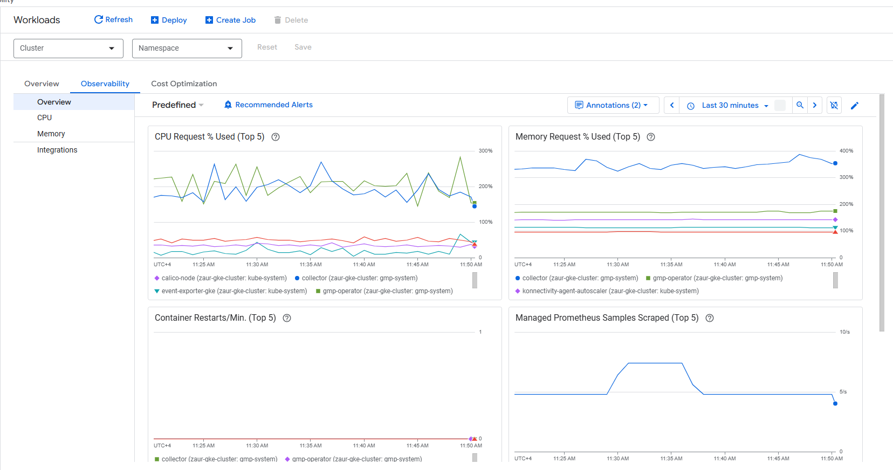
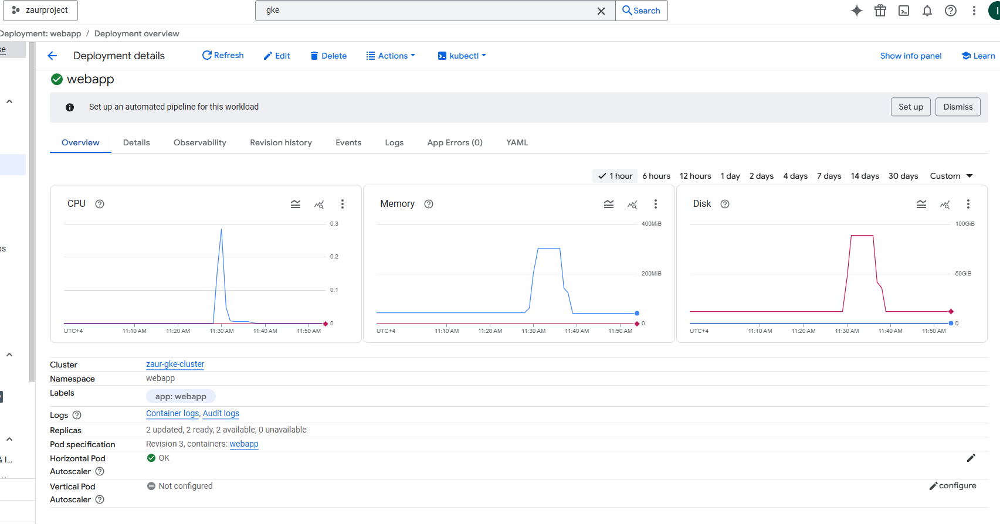
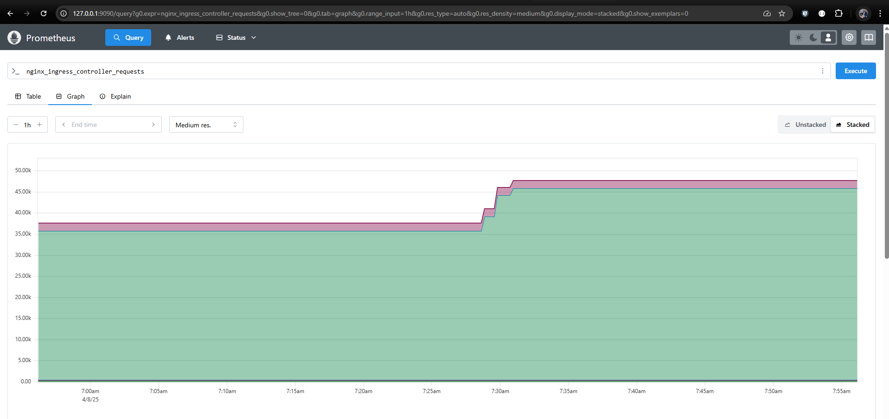
# 6. Incident Simulation
For the incident simulation we will use k6 tools with tests/k6_chaos.js script.
```shell
k6 run --vus 1000 --duration 180s k6_chaos.js
```
```shell

         /\      Grafana   /‾‾/
    /\  /  \     |\  __   /  /
   /  \/    \    | |/ /  /   ‾‾\
  /          \   |   (  |  (‾)  |
 / __________ \  |_|\_\  \_____/

     execution: local
        script: k6_chaos.js
        output: -

     scenarios: (100.00%) 1 scenario, 1000 max VUs, 3m30s max duration (incl. graceful stop):
              * default: 1000 looping VUs for 3m0s (gracefulStop: 30s)

WARN[0055] Request Failed                                error="unexpected EOF"
WARN[0056] Request Failed                                error="unexpected EOF"
WARN[0107] Request Failed                                error="unexpected EOF"
WARN[0162] Request Failed                                error="unexpected EOF"


  █ TOTAL RESULTS

    HTTP
    http_req_duration.......................................................: avg=704.99ms min=176.57ms med=238.58ms max=5.31s p(90)=1.82s p(95)=2.48s
      { expected_response:true }............................................: avg=704.75ms min=176.72ms med=238.84ms max=5.31s p(90)=1.82s p(95)=2.48s
    http_req_failed.........................................................: 50.01% 52970 out of 105906
    http_reqs...............................................................: 105906 582.001394/s

    EXECUTION
    iteration_duration......................................................: avg=1.7s     min=1.17s    med=1.23s    max=6.31s p(90)=2.82s p(95)=3.48s
    iterations..............................................................: 105906 582.001394/s
    vus.....................................................................: 15     min=15              max=1000
    vus_max.................................................................: 1000   min=1000            max=1000

    NETWORK
    data_received...........................................................: 19 MB  104 kB/s
    data_sent...............................................................: 8.9 MB 49 kB/s


running (3m02.0s), 0000/1000 VUs, 105906 complete and 0 interrupted iterations
default ✓ [======================================] 1000 VUs  3m0s
```
The /chaos endpoint makes pods return http '500' status code, which also makes liveness-probe state become failed and finally restarts pod.
We can see a lot of restarted pods.
```shell
kubectl get po -nwebapp -w
NAME                     READY   STATUS    RESTARTS        AGE
webapp-dfbdc55d4-4vjrw   1/1     Running   1 (3m ago)      4m10s
webapp-dfbdc55d4-55rcs   1/1     Running   1 (2m55s ago)   4m25s
webapp-dfbdc55d4-78c2w   1/1     Running   0               4m10s
webapp-dfbdc55d4-947nt   1/1     Running   0               4m25s
webapp-dfbdc55d4-bcpjx   1/1     Running   1 (9s ago)      4m10s
webapp-dfbdc55d4-cvt6s   1/1     Running   2 (3m10s ago)   37m
webapp-dfbdc55d4-h87g5   1/1     Running   2 (55s ago)     4m25s
webapp-dfbdc55d4-mlbx7   1/1     Running   1 (3m35s ago)   5m26s
webapp-dfbdc55d4-n52tg   1/1     Running   2 (49s ago)     4m10s
webapp-dfbdc55d4-nl25j   1/1     Running   1 (3m9s ago)    4m10s
webapp-dfbdc55d4-p786d   1/1     Running   5 (50s ago)     5d19h
webapp-dfbdc55d4-qh47v   1/1     Running   3 (25s ago)     5m26s
webapp-dfbdc55d4-spr9m   1/1     Running   0               4m10s
webapp-dfbdc55d4-wj6kc   1/1     Running   0               4m25s
webapp-dfbdc55d4-xx78c   1/1     Running   1 (3m9s ago)    4m10s
webapp-dfbdc55d4-cvt6s   1/1     Running   3 (2s ago)      37m
webapp-dfbdc55d4-xx78c   1/1     Running   2 (2s ago)      4m14s
webapp-dfbdc55d4-mlbx7   1/1     Running   2 (1s ago)      5m32s
webapp-dfbdc55d4-55rcs   1/1     Running   2 (2s ago)      4m33s
webapp-dfbdc55d4-n52tg   1/1     Running   3 (2s ago)      4m23s
webapp-dfbdc55d4-p786d   1/1     Running   6 (1s ago)      5d19h
webapp-dfbdc55d4-nl25j   1/1     Running   2 (1s ago)      4m32s
webapp-dfbdc55d4-4vjrw   1/1     Running   2 (2s ago)      5m2s
webapp-dfbdc55d4-78c2w   1/1     Running   1 (1s ago)      5m3s
webapp-dfbdc55d4-947nt   1/1     Running   1 (1s ago)      5m23s
webapp-dfbdc55d4-xx78c   1/1     Running   3 (1s ago)      5m12s
webapp-dfbdc55d4-cvt6s   1/1     Running   4 (2s ago)      38m
webapp-dfbdc55d4-h87g5   1/1     Running   3 (1s ago)      5m51s
webapp-dfbdc55d4-n52tg   1/1     Running   4 (1s ago)      6m1s
webapp-dfbdc55d4-bcpjx   1/1     Running   2 (1s ago)      6m2s
webapp-dfbdc55d4-xx78c   1/1     Running   4 (1s ago)      6m12s
webapp-dfbdc55d4-nl25j   1/1     Running   3 (1s ago)      6m12s
webapp-dfbdc55d4-947nt   1/1     Running   2 (2s ago)      6m32s
webapp-dfbdc55d4-cvt6s   1/1     Running   5 (1s ago)      39m
webapp-dfbdc55d4-4vjrw   1/1     Running   3 (1s ago)      6m21s
webapp-dfbdc55d4-mlbx7   1/1     Running   3 (1s ago)      7m42s
```
See 500 code in Prometheus
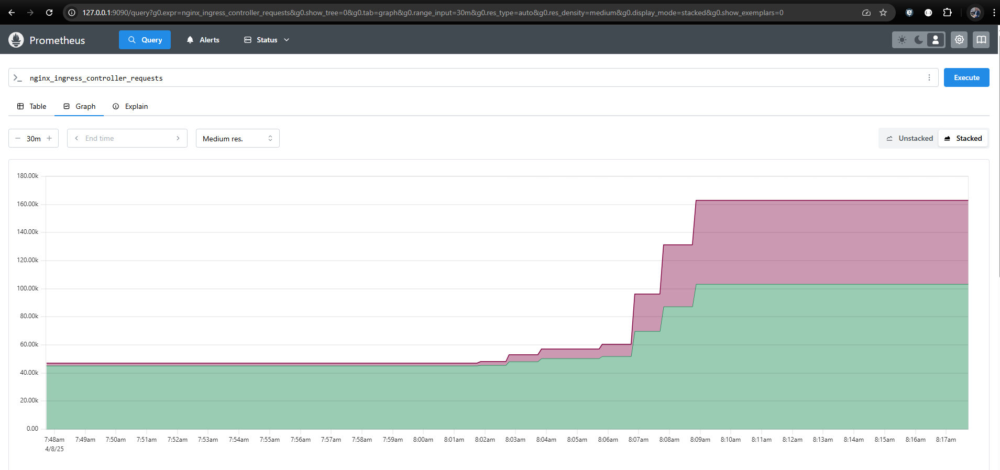
Looking errors from GCP Log explorer.
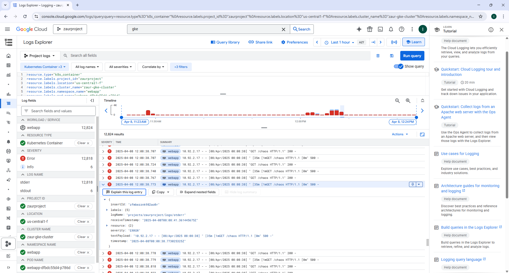 

Incident Simulation is completed.