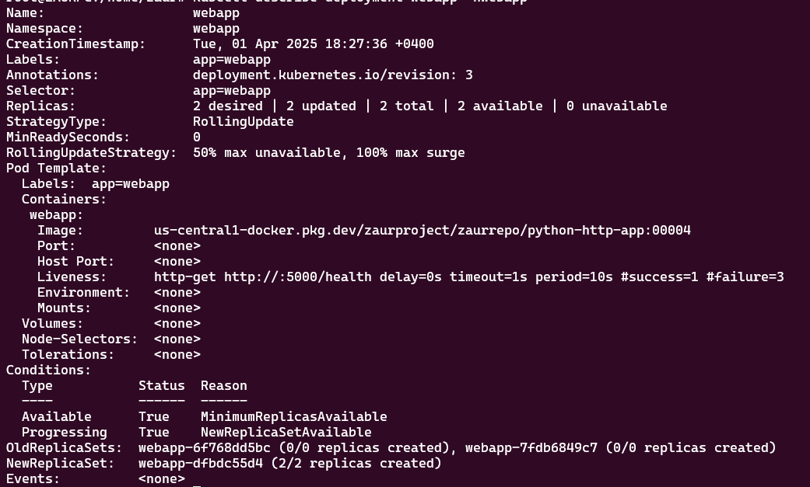

# Creating GKE cluster with ingress, network policy, and autoscaling

# List of works.
-----
 
## 1. Kubernetes Cluster Setup
## 2. Build and Push Web Application 
## 3. Deploy Web Application into the kubernetes cluster
## 4. Adding Network policy for the security purposes 
## 5. Autoscaling Based on HTTP Request Rate
## 6. Incident Simulation
</br >
</br > 

# Common task: Installing necessary tools.

- [x] DOCKER installing:
```shell
curl -fsSL https://get.docker.com | sudo bash
```
- [x] GCLOUD installing:
```shell
echo "deb [signed-by=/usr/share/keyrings/cloud.google.gpg] https://packages.cloud.google.com/apt cloud-sdk main" | tee -a /etc/apt/sources.list.d/google-cloud-sdk.list && curl https://packages.cloud.google.com/apt/doc/apt-key.gpg | sudo gpg --dearmor -o /usr/share/keyrings/cloud.google.gpg && sudo apt update -y && apt-get install google-cloud-sdk -y && \ 
sudo apt-get install -y google-cloud-cli-gke-gcloud-auth-plugin
```
- [x] TERRAFORM installing:
```shell
sudo apt-get install -y gnupg software-properties-common &&
wget -O- https://apt.releases.hashicorp.com/gpg | gpg --dearmor | sudo tee /usr/share/keyrings/hashicorp-archive-keyring.gpg > /dev/null
gpg --no-default-keyring --keyring /usr/share/keyrings/hashicorp-archive-keyring.gpg --fingerprint &&
echo "deb [signed-by=/usr/share/keyrings/hashicorp-archive-keyring.gpg] \
https://apt.releases.hashicorp.com $(lsb_release -cs) main" | sudo tee /etc/apt/sources.list.d/hashicorp.list && sudo apt update -y && \
sudo apt-get install -y terraform
```
- [x] KUBECTL installing:
```shell
sudo apt-get install -y apt-transport-https ca-certificates curl gnupg && \
sudo mkdir -p -m 755 /etc/apt/keyrings && \
curl -fsSL https://pkgs.k8s.io/core:/stable:/v1.32/deb/Release.key | sudo gpg --dearmor -o /etc/apt/keyrings/kubernetes-apt-keyring.gpg && \
sudo chmod 644 /etc/apt/keyrings/kubernetes-apt-keyring.gpg && \
echo 'deb [signed-by=/etc/apt/keyrings/kubernetes-apt-keyring.gpg] https://pkgs.k8s.io/core:/stable:/v1.32/deb/ /' | sudo tee /etc/apt/sources.list.d/kubernetes.list && sudo chmod 644 /etc/apt/sources.list.d/kubernetes.list && \
sudo apt-get update && \
sudo apt-get install -y kubectl
```

# 1. Kubernetes Cluster Setup
- Login into GCP console using your login and password.
- Create new project. (we will use it while creating infrastructure).
- Create artifact registry for docker images.
- Deploy kubernetes cluster with terraform tool:
```shell
cd terraform
terraform init
terraform plan
gcloud auth application-default login #necessary for terraform
terraform apply
```
- Checking newly created cluster in GCP console.


- Login to created cluster with gcloud tool.
```shell

gcloud config set compute/region us-central1
gcloud config set compute/zone us-central1-f
gcloud container clusters get-credentials zaur-gke-cluster

```
- Checking cluster with kubectl tool.
```shell

kubectl config get-clusters

```

- You can check list of all available pods by command:
```shell

kubectl get po -A

```

# 2. Build and Deploy Web Application
We will use sample web application with three endpoints ( '/', '/health', and '/chaos' )
```python

@app.route('/', methods=['GET'])
def index():
    """Standard application response."""
    return jsonify({"message": "Hello from world!"})

@app.route('/chaos', methods=['GET'])
def chaos():
    """Endpoint to trigger a health-check failure scenario."""
    global IsChaosEnabled
    IsChaosEnabled = not IsChaosEnabled  # Toggle the chaos state

    if IsChaosEnabled:
        return jsonify({"message": "Chaos mode activated!"}), 500  # Simulate failure
    else:
        return jsonify({"message": "Chaos mode deactivated!"})

@app.route('/health', methods=['GET'])
def health():
    """Health check endpoint. Return 200 if healthy, 500 if chaotic."""
    if IsChaosEnabled:
        return jsonify({"status": "unhealthy"}), 500
    else:
        return jsonify({"status": "healthy"}), 200

```
Get whole code in the webapp folder.

- [X] Creating docker image from python code:
```shell
cd webapp
sudo docker build -t python-http-app .
sudo docker images # will show us docker images
```


- [X] Tagging and Pulling created docker image into google cloud registry:
```shell
docker tag 1b017fb0b721 us-central1-docker.pkg.dev/zaurproject/zaurrepo/python-http-app:00004
docker push us-central1-docker.pkg.dev/zaurproject/zaurrepo/python-http-app:00004
```


## 3. Deploying Web Application into the kubernetes cluster

- [X] Connecting to the cluster
```shell

gcloud config set compute/region us-central1
gcloud config set compute/zone us-central1-f
gcloud container clusters get-credentials zaur-gke-cluster

```
- [X] Creating new namespace for our application
```shell
kubectl create namespace webapp
```

- [X] Deploying webapp application to the kubernetes
```shell
cd k8s
kubectl apply -f webapp-deployment.yaml
```
- [X] Checking newly created deployment
```shell
kubectl describe deployment webapp -nwebapp
```

- [X] Checking for running pods
```shell
kubectl get po -nwebapp
```


- [X] Adding ingress controller and application service
```shell
kubectl apply -f webapp-service.yaml
kubectl apply -f ingress-controller.yaml
kubectl apply -f ingress.yaml
```


# 4. Adding Network policy for the security purposes 
- [X] Deny all traffic between pods in webapp namesapace
```shell
cd k8s
kubectl apply -f NetworkDenyAll.yaml
```

- [X] Allow only ingress traffic from ingress controller
```shell
cd k8s
kubectl apply -f NetworkAllowFromIngress.yaml
```
